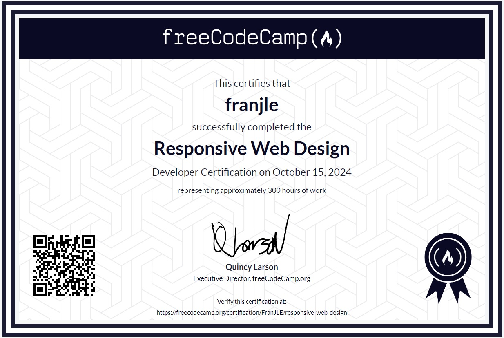

# Responsive Web Design Courses  
Con la finalidad de aprender nuevos tags y más propiedades CSS, decidí hacer los   
cursos de freeCodeCamp centrados en ello.  
En este repositorio no subo las soluciones que yo utilicé para superar los "Certification Project"  
que hay.  
  
**Consejo** Para los hispanohablantes con nivel medio o superior en inglés, recomiendo hacer  
los cursos en dicho idioma, ya que así se practican dos cosas ☺
## Certificado obtenido
